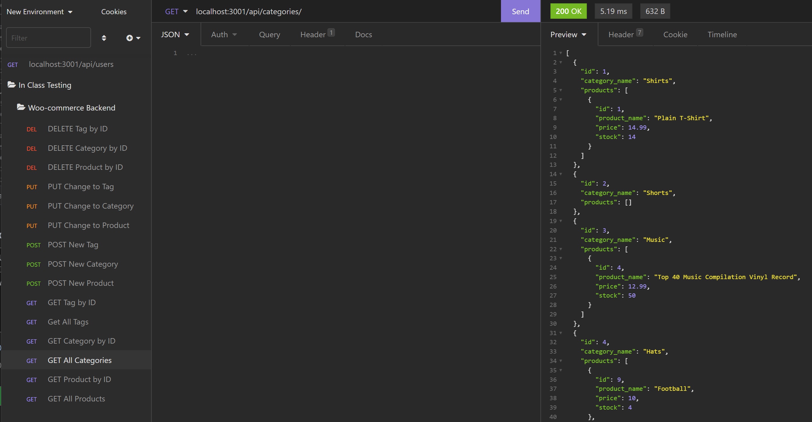

# Woo Commerce Back End

## Description
Back-end database and routes to hook up an internet retail company

## Table of Contents
* [Installation](#installation)
* [Usage](#usage)
* [Contributors](#contributors)
* [Tests](#tests)
* [Questions](#questions)
* [License](#license) 

## Installation
Run "npm i" to install all dependencies, and use Insomnia to test the routes.

## Usage
Used to demonstrate the processes which occur on the server side. Screen shot will be added below with demonstration of tests.

## Contributors
None.

## Tests
Tested all routes with Insomnia

Contact information (email address & GitHub username) of the developer
## Questions
kevin.o.foreman2@gmail.com // (GitHub) kevin-foreman

## License

The license used for this project is AGPL v3

Screenshot

